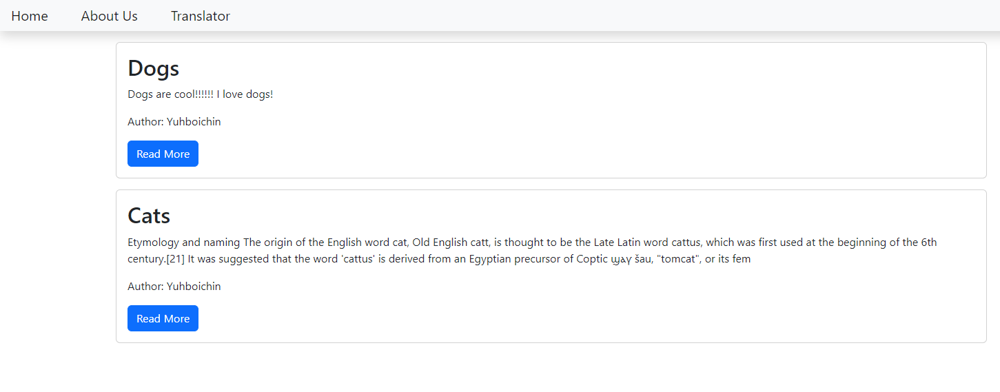
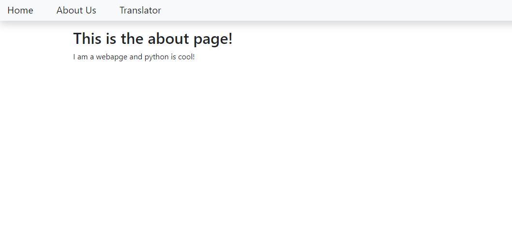
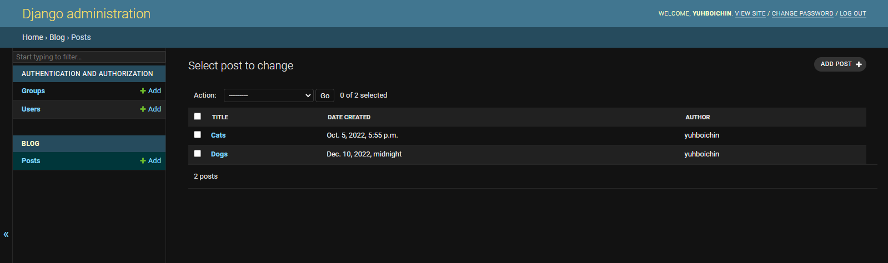

# Blog and Translator Web Apps
This web page consists of two web apps, a blog making app and a translator app. A user, when given admin status, is able to post blogs
that are displayed on the home page. When a user selects the transltor tab they will be redirected to the translator page. From there they can enter text 
in the left textbox that will, when the translate button is pressed, translate the text into german. There is also an admin page from which a registered user 
can edit and delete posts as need as well as editing there profile information.

The main objective was to excercise the use of Django in the creation of a webpage with multiple web apps. Another objective was to study the architecture of Django 
and understand the relationships between models, views, urls and htmls within Django.

A virtual python environment was used as "fresh" installation of python when install Django and other necessary libraries. The virtual file is not included due to size

